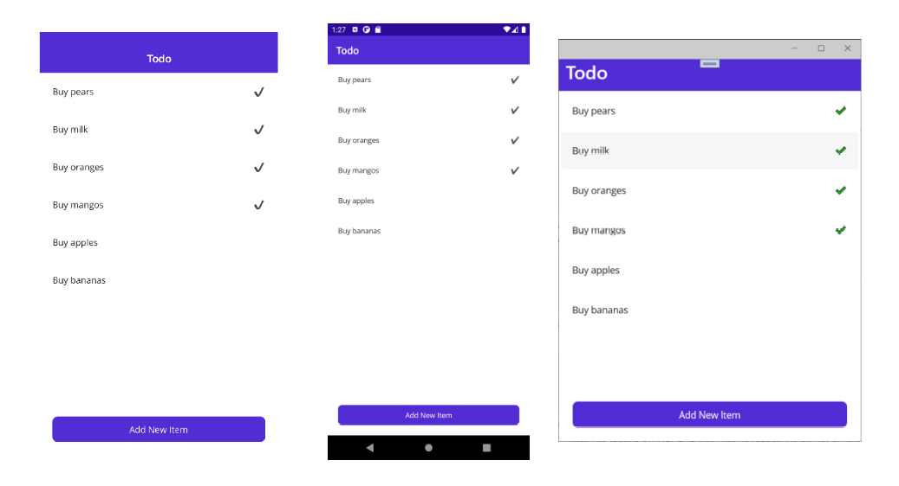

# MAUI-TodoSQLite

### Local Database with SQLite
This sample demonstrates how to store data in a local database using SQLite in .NET MAUI applications.

For more information about the sample see Local Databases with SQlite documentaiton.

Ref.: [.NET MAUI - Local Database with SQLite](https://github.com/dotnet/maui-samples/tree/main/6.0/Data/TodoSQLite)

[Store local data with SQLite in a .NET MAUI app](https://learn.microsoft.com/en-us/training/modules/store-local-data/)

&nbsp;

### Libraries

- sqlite-net-pcl
- SQLitePCLRaw.bundle_green

&nbsp;

### Ved problemer
Hvis der er problemer med at oprette en connection kan det være nødvendigt at slette en tidligere database.
Dette kan gøres ved at slette App'en fra emulator eller telefon.